# SimCLR 기반 Feature Representation Learning 실험 분석 보고서

---

## 1. 개요

본 보고서는 Self-Supervised Learning(SSL)의 대표 프레임워크인 SimCLR을 CIFAR-10 데이터셋에 적용하여, 학습된 feature representation의 특성을 분석한 실험 결과를 정리한 것이다. 단순한 분류 성능 비교를 넘어, representation이 어떻게 형성되는지, 어떤 조건에서 collapse가 발생하는지, latent space에서 클래스 구조가 어떻게 나타나는지를 중점적으로 분석하였다.

---

## 2. 실험 환경

| 항목 | 내용 |
|---|---|
| 데이터셋 | CIFAR-10 (train 50,000 / test 10,000) |
| Backbone | ResNet18 (기본), ResNet34, ResNet50 비교 |
| 학습 epochs | 200 (SimCLR pretraining) |
| 평가 방법 | Linear Probe, KNN (k=1,5,10,20,200) |
| Feature 분석 지표 | Effective Rank, Dead Dimensions, Silhouette Score, Davies-Bouldin Index, Uniformity |

**평가 지표 설명:**
- **Linear Probe Accuracy**: backbone을 freeze하고 linear classifier만 학습. representation 품질의 핵심 지표
- **KNN Accuracy (k=200)**: label 없이 feature 유사도만으로 분류. representation 구조 반영
- **Effective Rank**: feature의 실질적 차원 수. 낮을수록 특정 방향으로 collapse된 것
- **Dead Dimensions**: 활성화가 거의 없는 feature 차원 수. collapse 지표
- **Silhouette Score**: 클래스 간 분리도 (−1~1, 높을수록 클래스 구분 명확)
- **Davies-Bouldin Index (DBI)**: 클러스터 분리도 (낮을수록 좋음)
- **Uniformity**: feature가 unit sphere에 균등 분포하는 정도 (낮을수록 균일)

---

## 3. SimCLR 기본 구현 및 학습

### 3.1 모델 구성

SimCLR의 기본 구조는 다음과 같다.

```
Input → Augmentation (View 1, View 2)
     → Backbone (ResNet18)
     → Projection Head (2-layer MLP, 512→256 dim)
     → NT-Xent Loss
```

Projection head는 contrastive learning에서만 사용되며, downstream task에는 backbone의 출력(512-dim)을 feature로 사용한다.

### 3.2 기본 실험 결과

| 지표 | 값 |
|---|---|
| Linear Probe Accuracy | **80.03%** |
| KNN Accuracy (k=10) | **79.65%** |
| KNN Accuracy (k=200) | 75.71% |
| Effective Rank | 307.3 |
| Dead Dimensions | 0 |
| Silhouette Score | 0.039 |
| Davies-Bouldin Index | 4.996 |
| Uniformity | −1.053 |

label을 전혀 사용하지 않고도 80%의 linear probe 성능을 달성하였으며, dead dimension이 전혀 없어 표현이 안정적으로 학습되었음을 확인하였다.

---

## 4. Supervised vs Self-Supervised Feature 비교

### 4.1 성능 비교

SimCLR(self-supervised)과 동일한 ResNet18 backbone을 cross-entropy loss로 fully supervised 학습한 결과를 비교하였다.

| 지표 | Supervised ResNet18 | SimCLR (Self-supervised) |
|---|---|---|
| Test Accuracy | **95.41%** | 80.03% (linear probe) |
| Effective Rank | **50.2** | 307.3 |
| Dead Dimensions | 0 | 0 |
| Silhouette Score | **0.823** | 0.039 |
| Davies-Bouldin Index | **0.484** | 4.996 |
| Uniformity | −2.133 | −1.053 |

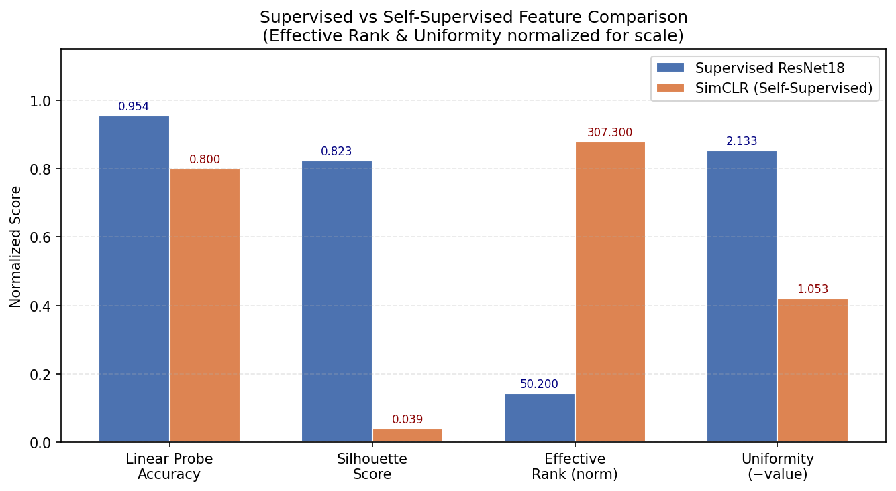

### 4.2 분석

**표현의 구조적 차이**

Supervised learning의 effective rank는 50.2로, SimCLR의 307.3에 비해 현저히 낮다. 이는 supervised model이 10개의 class label 방향으로 feature를 압축하는 반면, SimCLR은 훨씬 분산되고 다양한 방향으로 정보를 인코딩함을 의미한다. 즉, supervised feature는 분류 과제에 특화된 저차원 표현을 학습하고, SimCLR은 보다 범용적인 고차원 표현을 학습한다.

**클래스 분리도 차이**

Silhouette score 기준으로 supervised(0.823) > SimCLR(0.039)로, supervised feature space에서는 클래스 간 경계가 명확하게 형성된다. t-SNE 시각화에서도 supervised feature는 클래스별로 뚜렷이 군집화되는 반면, SimCLR feature는 완만하게 분포한다.

**Uniformity 차이**

SimCLR의 uniformity(−1.053)가 supervised(−2.133)보다 높다. 절댓값이 클수록 feature가 hypersphere에 더 균등하게 분포함을 의미하므로, supervised feature가 hypersphere 상에서 더 균일하게 분포한다고 해석할 수 있다.

**결론**

Supervised learning은 분류 성능(95.41%)은 높지만, class label에 최적화된 좁은 표현을 학습한다. SimCLR은 성능(80.03%)이 낮지만 더 풍부하고 범용적인 표현을 학습하여, label이 없는 상황이나 다른 downstream task로의 전이 학습에 유리하다.

---

## 5. Representation Collapse 분석

Representation collapse는 모든 입력에 대해 동일하거나 유사한 representation을 출력하는 현상으로, contrastive learning 및 SSL에서 핵심 문제 중 하나이다.

### 5.1 Loss Function별 Collapse 관찰

| Loss | Linear Probe | KNN | Effective Rank | Dead Dims | Silhouette |
|---|---|---|---|---|---|
| NT-Xent (SimCLR) | **80.25%** | 75.82% | 306.1 | **0** | 0.042 |
| Barlow Twins | 79.80% | 76.70% | 260.3 | 28 | 0.102 |
| SimSiam | 30.07% | 30.34% | 210.0 | **74** | **−0.322** |

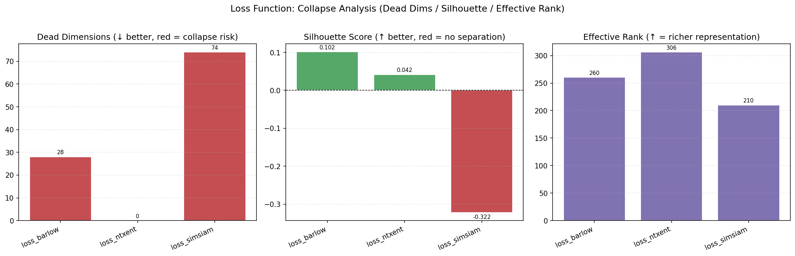

**SimSiam의 완전 collapse**: SimSiam은 negative pair 없이 stop-gradient만으로 collapse를 방지하는 구조이나, 본 실험에서는 명백한 collapse가 발생하였다. Linear probe 30.07%는 random baseline(10%)을 크게 상회하지 못하는 수준이며, silhouette score −0.322는 같은 클래스 내 샘플보다 다른 클래스 샘플이 더 가까이 위치함을 의미한다. 74개의 dead dimension은 표현의 다양성이 크게 손실되었음을 보여준다.

**Barlow Twins의 부분 collapse**: Barlow Twins는 cross-correlation matrix를 단위행렬에 가깝게 만들어 collapse를 방지하는 방식으로, NT-Xent 대비 28개의 dead dimension이 발생하지만 성능(79.80%)은 유지된다. 흥미롭게도 silhouette score(0.102)는 NT-Xent(0.042)보다 높아, 클래스 분리도 측면에서는 오히려 더 나은 표현을 형성한다.

### 5.2 Augmentation에 의한 Collapse

| Augmentation | Linear Probe | Dead Dims | Silhouette |
|---|---|---|---|
| Color Jitter만 | 44.27% | **13** | **−0.037** |
| Random Crop만 | 61.23% | 0 | −0.020 |
| Crop + Color | 77.86% | 0 | 0.025 |
| Full (SimCLR) | 80.12% | 0 | 0.044 |
| Full + Blur | 80.15% | 0 | 0.048 |

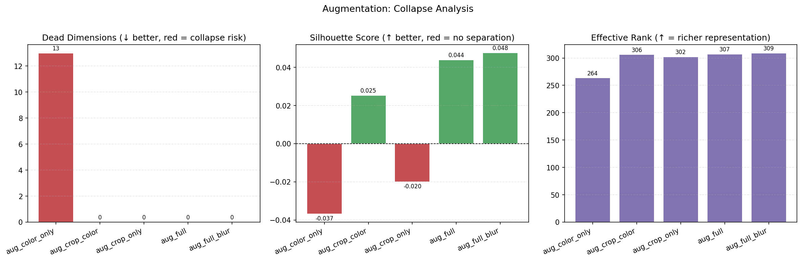

Color Jitter만 사용한 경우 13개의 dead dimension과 음수 silhouette이 관찰되었다. Color augmentation만으로는 서로 다른 이미지를 구분할 충분한 contrast를 만들지 못하여 부분적 collapse가 발생한 것으로 해석된다. Random Crop은 dead dimension이 없지만 silhouette이 여전히 음수로, 학습은 안정적이나 클래스 구조 형성이 부족하다. **두 augmentation의 조합이 처음으로 양수 silhouette를 만들어내며**, crop이 SimCLR에서 가장 핵심적인 augmentation임을 확인하였다.

### 5.3 Backbone에 의한 Collapse

| Backbone | Linear Probe | Dead Dims | Effective Rank |
|---|---|---|---|
| ResNet18 | 80.11% | 0 | 306.6 |
| ResNet34 | 80.32% | 2 | 308.3 |
| ResNet50 | **81.98%** | **1776** | **1068.4** |

ResNet50은 출력 차원이 2048이지만 1776개(86.7%)가 dead dimension이다. Effective rank는 1068로 수치상 높아 보이지만, 이는 실제 정보를 담은 극소수 차원에 분산이 집중되는 현상 때문이다. 큰 backbone이 반드시 더 좋은 표현을 만드는 것은 아니며, 오히려 과잉 파라미터가 특정 방향으로의 collapse를 유발할 수 있음을 시사한다.

---

## 6. Ablation Study

### 6.1 Augmentation의 영향

| Augmentation | Linear Probe | KNN (k=200) | Silhouette |
|---|---|---|---|
| Color Jitter만 | 44.27% | 39.44% | −0.037 |
| Random Crop만 | 61.23% | 52.19% | −0.020 |
| Crop + Color | 77.86% | 72.53% | 0.025 |
| Full (Crop+Color+Flip+Grayscale) | 80.12% | 75.79% | 0.044 |
| Full + Gaussian Blur | **80.15%** | **76.10%** | **0.048** |

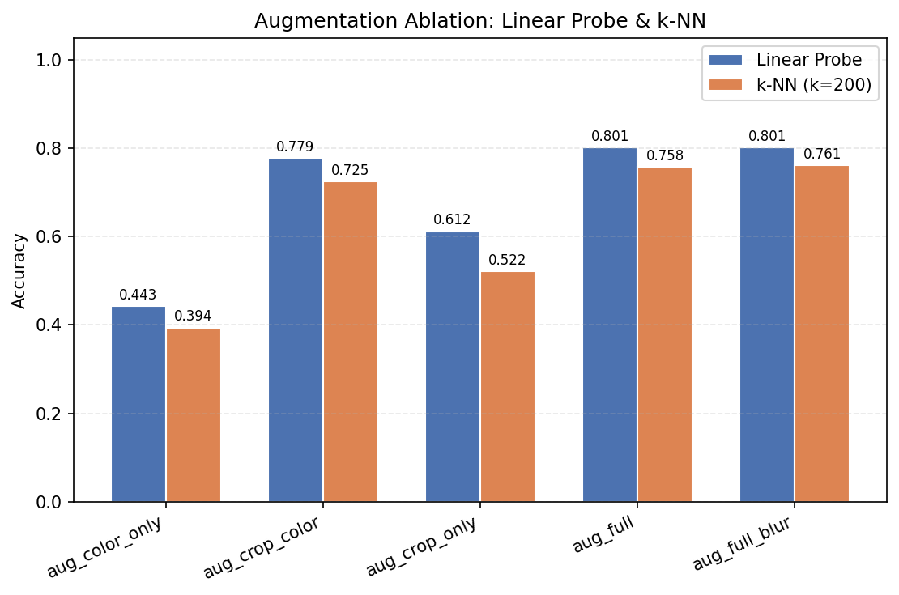

**해석**: Augmentation 조합이 SimCLR 성능에 가장 큰 영향을 미치는 요소이다. Color Jitter만 사용했을 때 44.27%에서 Full augmentation에서 80.12%로, **36%p 이상의 성능 차이**가 발생한다. 이는 SimCLR이 augmentation invariance를 학습하는 원리상 필연적인 결과이다. Random Crop은 이미지의 다른 부분을 같은 이미지로 인식하도록 강제하여, backbone이 객체의 전체 구조와 맥락을 학습하도록 유도한다. Gaussian Blur 추가 시 효과는 미미하지만 silhouette score가 소폭 향상되어 클래스 구조 형성에 도움이 된다.

### 6.2 Projection Head 구조의 영향

| Projection Head | Linear Probe | KNN (k=200) | Effective Rank | Silhouette |
|---|---|---|---|---|
| 1-layer Linear | 79.88% | 74.68% | 312.0 | 0.017 |
| 2-layer MLP (기본) | **80.03%** | 75.32% | 308.6 | **0.043** |
| 3-layer MLP | 79.83% | **75.77%** | 302.5 | 0.041 |

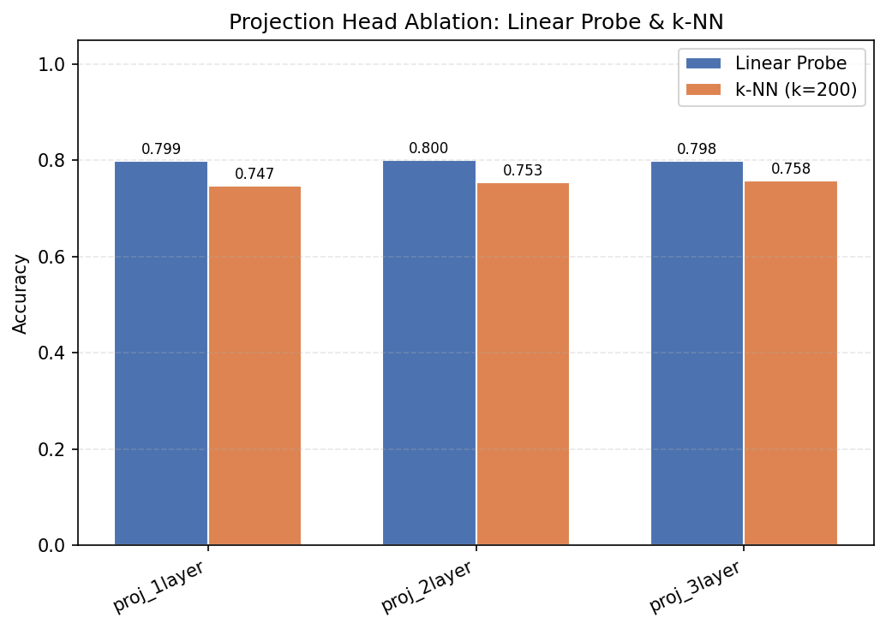

**해석**: Projection head의 깊이는 성능에 큰 영향을 주지 않는다(79.83~80.03%). 그러나 1-layer의 경우 silhouette score(0.017)가 2-layer, 3-layer(0.043, 0.041) 대비 절반 수준으로 낮아, 클래스 간 feature 분리도가 떨어진다. 이는 비선형 변환을 포함한 MLP가 backbone의 feature와 contrastive 공간을 보다 효과적으로 분리하여 backbone에 더 의미 있는 표현을 남기기 때문으로 해석된다. 2-layer와 3-layer 간 차이는 미미하여 2-layer가 complexity 대비 효율이 가장 좋다.

### 6.3 Batch Size의 영향

| Batch Size | Linear Probe | KNN (k=200) | Effective Rank | Silhouette |
|---|---|---|---|---|
| 64 | 78.87% | 74.29% | 296.0 | 0.038 |
| 128 | 79.56% | 75.64% | 302.8 | 0.039 |
| 256 | 79.83% | 75.82% | 307.2 | 0.048 |
| 512 | **80.32%** | 75.38% | **312.9** | 0.040 |

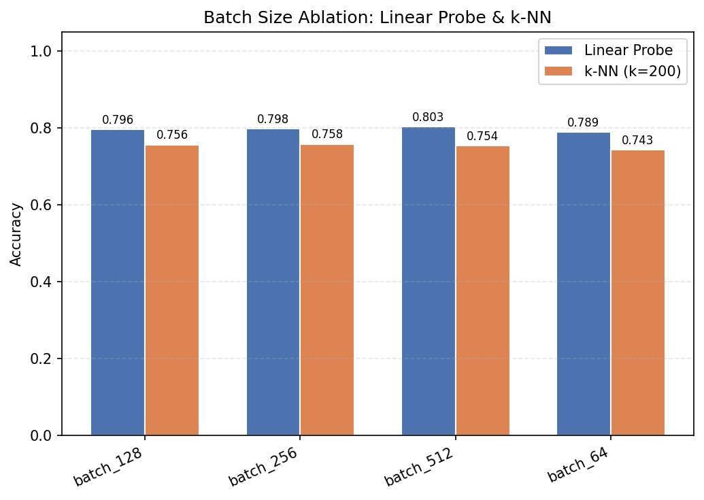

**해석**: Batch size가 클수록 성능이 향상되는 경향이 관찰된다. SimCLR은 같은 배치 내 다른 샘플들을 negative pair로 사용하는 구조이므로, 배치 크기가 클수록 더 많은 negative sample과 비교하게 되어 더 discriminative한 representation을 학습한다. 다만 256→512 구간에서 KNN 성능이 오히려 하락(75.82%→75.38%)하는데, 이는 negative pair 수 증가의 효과가 포화되기 시작함을 시사한다. Effective rank는 배치 크기와 함께 증가하여, 큰 배치가 더 분산된 표현 학습에 도움을 준다.

### 6.4 Temperature(τ)의 영향

| Temperature (τ) | Linear Probe | KNN (k=200) | Effective Rank | Silhouette | Uniformity |
|---|---|---|---|---|---|
| 0.05 | 78.79% | 74.82% | 300.4 | 0.037 | −0.979 |
| 0.07 | 79.97% | 76.05% | 309.8 | 0.040 | −1.030 |
| 0.10 | 81.87% | **78.00%** | 304.1 | 0.066 | −1.327 |
| 0.50 | **82.86%** | 78.65% | 254.5 | **0.137** | **−1.418** |

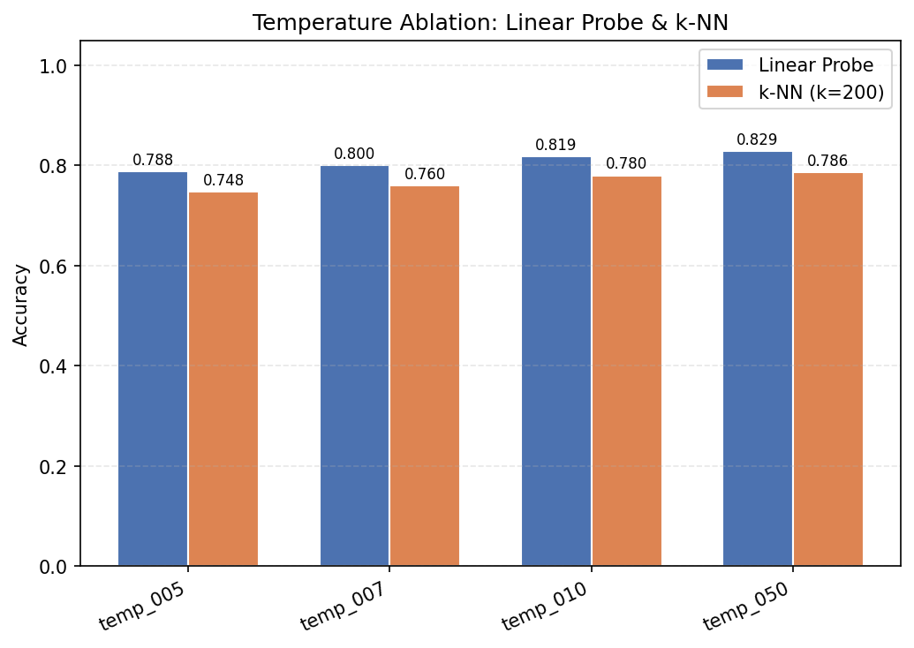

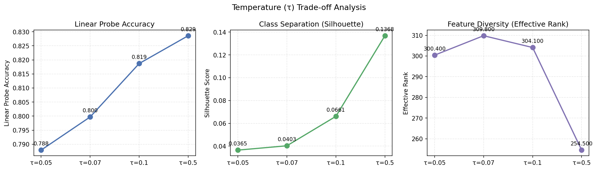

**해석**: Temperature는 NT-Xent loss에서 positive/negative pair 간 거리를 얼마나 예민하게 볼 것인지를 조절하는 파라미터이다. τ가 높을수록(0.50) linear probe 성능(82.86%)과 silhouette score(0.137)가 모두 향상되어 클래스 분리가 더 명확한 표현을 형성한다. 반면 uniformity는 −1.418로 낮아져 hypersphere에 더 균일하게 분포하는 대신 클러스터가 더 뚜렷하게 형성된다. Effective rank가 300→255로 감소하는 점은 주목할 만한데, 높은 τ에서 표현이 더 클래스 방향으로 압축되는 경향이 있음을 시사한다. τ가 낮을 때(0.05)는 매우 어려운 negative에 집중하게 되어 학습이 불안정해지고 성능이 저하된다.

---

## 7. 추가 실험

### 7.1 Backbone 비교 (ResNet18 / 34 / 50)

| Backbone | Linear Probe | KNN (k=200) | Effective Rank | Dead Dims | Silhouette |
|---|---|---|---|---|---|
| ResNet18 | 80.11% | 75.87% | 306.6 | 0 | 0.043 |
| ResNet34 | 80.32% | **77.83%** | 308.3 | 2 | 0.044 |
| ResNet50 | **81.98%** | 75.98% | **1068.4** | **1776** | 0.037 |

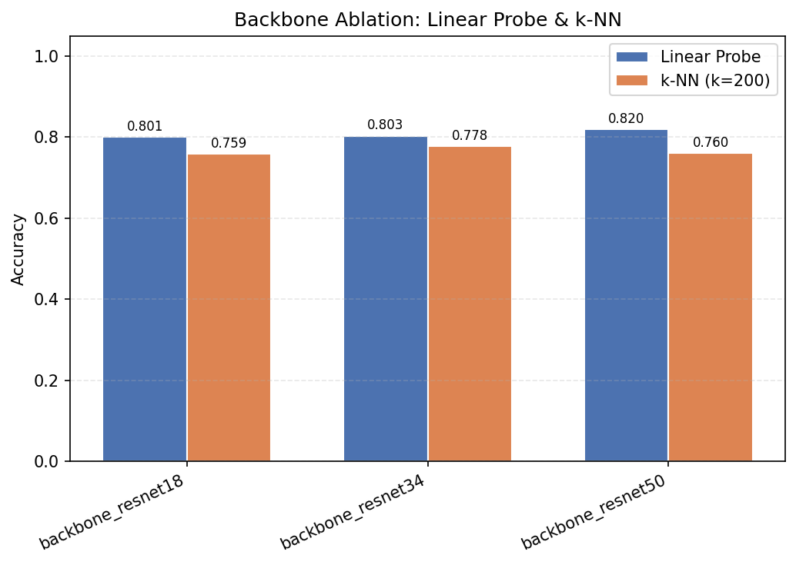

**해석**: ResNet50은 최고 linear probe 성능(81.98%)을 기록하지만, 출력 2048차원 중 1776개(86.7%)가 dead dimension으로 표현 효율이 매우 낮다. 이는 SimCLR의 학습 목표가 ResNet50의 과잉 파라미터를 모두 활용하기에 충분한 신호를 제공하지 못함을 의미한다. ResNet34는 성능(80.32%)과 표현 품질(dead dims=2) 모두 균형 잡힌 결과를 보이며, 제한된 자원에서 가장 효율적인 선택이다. ResNet18은 dead dimension이 전혀 없으며 성능도 충분하여 CIFAR-10 규모에서는 과도한 backbone 용량이 오히려 불리할 수 있다.

### 7.2 Loss Function 비교 (NT-Xent / Barlow Twins / SimSiam)

| Loss | Linear Probe | KNN (k=200) | Effective Rank | Dead Dims | Silhouette | DBI |
|---|---|---|---|---|---|---|
| NT-Xent (SimCLR) | **80.25%** | 75.82% | 306.1 | **0** | 0.042 | 4.78 |
| Barlow Twins | 79.80% | **76.70%** | 260.3 | 28 | **0.102** | **3.90** |
| SimSiam | 30.07% | 30.34% | 210.0 | 74 | −0.322 | 13.00 |

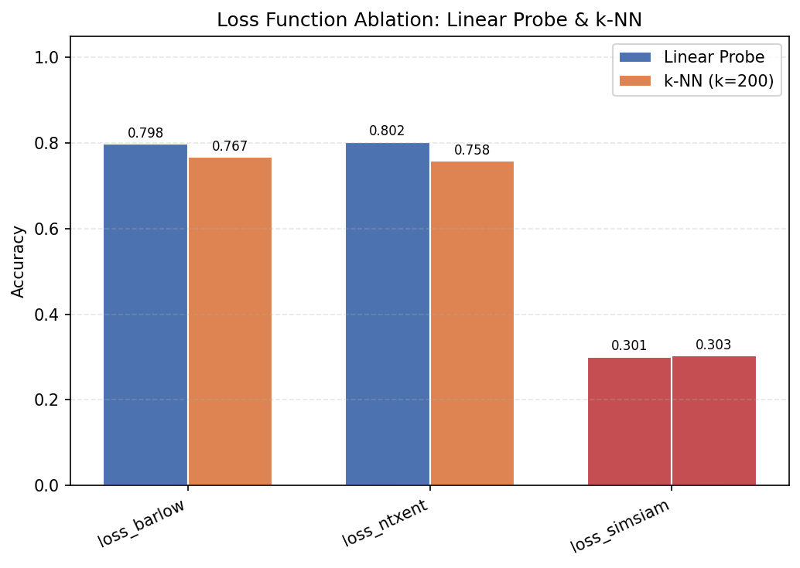

**해석**: 
- **NT-Xent**는 dead dimension이 없고 안정적이며, linear probe 성능이 가장 높다.
- **Barlow Twins**는 28개의 dead dimension이 발생하지만, silhouette(0.102)과 DBI(3.90)가 NT-Xent보다 우월하여 클래스 분리 측면에서 더 구조적인 표현을 학습한다. KNN 성능(76.70%)도 가장 높아, label 없이도 클래스를 구분하기 좋은 표현임을 시사한다.
- **SimSiam**은 완전한 collapse 상태로, 실험 설정(학습률, 예측 네트워크 구조 등)에 대한 민감도가 높아 하이퍼파라미터 조정 없이는 안정적 학습이 어렵다.

---

## 8. Latent Space 시각화 (t-SNE)

SimCLR과 Supervised ResNet18의 feature를 t-SNE로 2차원에 투영하여 비교하였다.

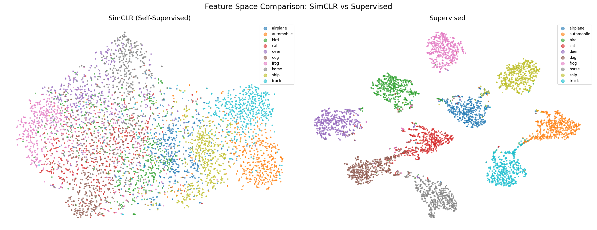

**관찰 결과:**

- **Supervised feature (오른쪽)**: 10개 클래스가 뚜렷하게 분리된 군집을 형성하며, 클러스터 간 경계가 명확하다. silhouette=0.823이 시각적으로도 명확히 드러난다.

- **SimCLR feature (왼쪽)**: 클래스별 군집이 존재하나 경계가 흐릿하며, 유사한 클래스(예: automobile/truck, cat/dog)끼리 인접하는 경향이 있다. 이는 SimCLR이 클래스 label 없이 시각적 유사성 기반의 표현을 학습했기 때문이다.

- 두 방법 모두 완전 무작위 상태보다는 훨씬 구조화된 latent space를 형성하며, SimCLR 표현도 클래스 정보를 상당 부분 내포하고 있음을 확인하였다.

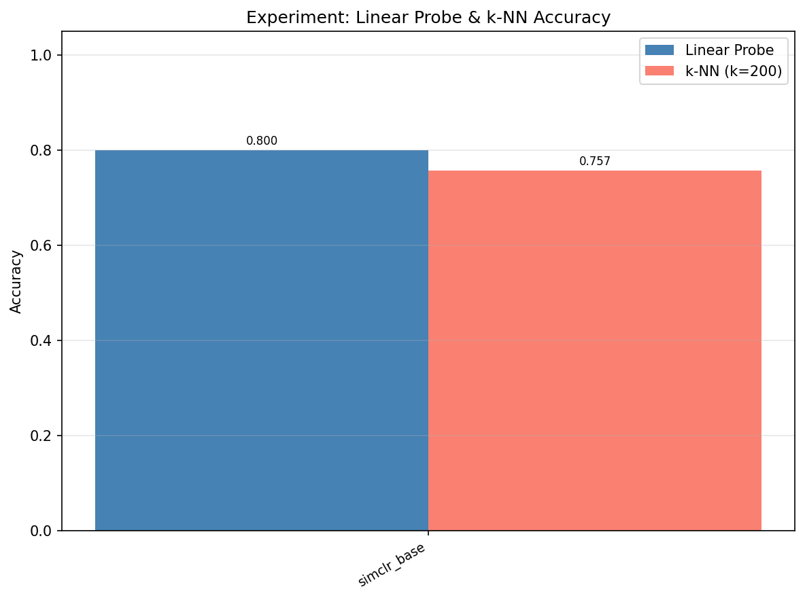
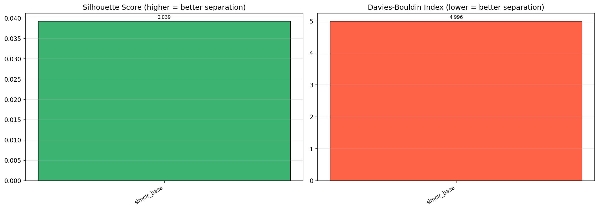

---

## 9. 결론

### 9.1 주요 발견 요약

| 분석 항목 | 주요 발견 |
|---|---|
| SSL vs Supervised | SSL은 범용적 고차원 표현(rank 307), Supervised는 class-specific 저차원 표현(rank 50)을 학습 |
| Collapse 분석 | SimSiam(loss), Color-only aug, ResNet50 backbone에서 collapse 발생 확인 |
| Augmentation | 가장 영향력 큰 요소. Crop이 핵심이며 Full aug 대비 color-only는 −36%p |
| Projection Head | 깊이보다 비선형 변환 존재 여부가 중요. 2-layer 최적 |
| Batch Size | 클수록 좋으나 512 이상에서 효과 포화 |
| Temperature | 높을수록 클래스 분리 향상(silhouette ↑), rank는 감소 |
| Backbone | ResNet50은 성능은 높지만 86% dead dimension 발생 |
| Loss Function | NT-Xent가 가장 안정적. Barlow Twins는 클래스 분리도 우수. SimSiam은 collapse |

### 9.2 Supervised vs SSL Feature 차이 종합

Supervised learning은 label 정보를 직접 최적화하여 클래스 방향으로 feature를 압축하므로, 높은 분류 성능(95.41%)과 뚜렷한 클래스 분리(silhouette 0.823)를 보인다. 그러나 이 표현은 훈련 과제에 과적합된 특성을 가진다.

SimCLR은 augmentation invariance를 학습하면서 이미지의 다양한 시각적 특성을 저장하는 범용 표현을 형성한다. 분류 성능(80.03%)은 낮지만, 더 높은 effective rank(307)와 고른 feature 분포를 보인다. 이는 label이 부족한 환경에서 사전 학습 후 fine-tuning하는 시나리오에서 유리하게 작용한다.

### 9.3 Representation Collapse 종합

Collapse는 세 가지 경로로 발생하였다.
1. **Loss 설계 문제**: SimSiam의 stop-gradient만으로는 collapse 방지가 불충분 (dead dims=74, silhouette=−0.322)
2. **부족한 Augmentation**: Color-only의 경우 positive pair가 너무 유사하여 discriminative한 signal 부족 (dead dims=13)
3. **과도한 Backbone 용량**: ResNet50의 2048차원 중 1776개 사멸, 학습 신호 대비 파라미터 과잉

NT-Xent loss + 충분한 augmentation + 적절한 backbone 크기의 조합이 collapse를 효과적으로 방지한다.

### 9.4 최적 설정 권고

| 요소 | 권장 설정 | 근거 |
|---|---|---|
| Augmentation | Full (Crop + Color + Flip + Grayscale + Blur) | Crop이 필수, Blur 소폭 개선 |
| Backbone | ResNet18 또는 ResNet34 | ResNet50은 dead dimension 과다 |
| Batch Size | 256 이상 | 성능-자원 균형 |
| Projection Head | 2-layer MLP | 비선형 변환 필요, 3-layer 대비 차이 없음 |
| Temperature | 0.1~0.5 | 0.5에서 클래스 분리 최적 |
| Loss | NT-Xent | 안정성 최우선 |

---

*CIFAR-10 / ResNet18 기반 SimCLR 실험 분석 보고서*
